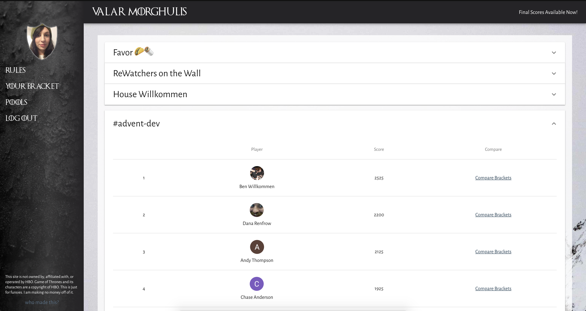

## About the Deadpool
[Thrones Deadpool](http://thronesdeadpool.com) allowed fans of Game of Thrones to predict which characters would die when during the final season of the HBO show. Prior to the season premiere, users could make pools and invite others to join their pools. Each user then filled out a bracket in which they marked each character as dying in a specific episode, or as a survivor. Scores were calculated after each episode.

With minimal promotion, the game drew 810 users and 225 pools.

### How It Works
Thrones Deadpool uses Google's Firebase features:
* **Firestore**: the app's datastor
* **Auth**: the app's authentication and user store
* **Functions**: Lambda-like serverless functions, used to calculate scores

